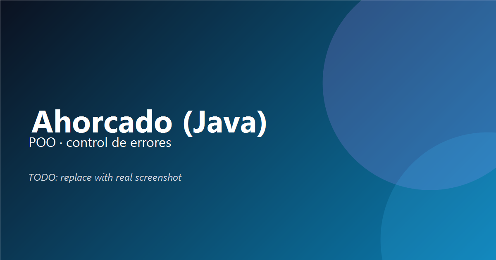

🌐 Portfolio: TODO · 💼 LinkedIn: TODO · ✉️ Email: TODO

## Hi, I'm Alberto Gálvez

Estudiante DAW/DAM.  
Enfocado en construir proyectos full-stack con Java, SQL y JavaScript con buenas prácticas.

- Estoy trabajando en: proyectos Full Stack (frontend + API + BD)
- Estoy aprendiendo: Spring Boot y React
- Fun fact: me gusta optimizar rendimiento y dejar README impecables

## My Tech Stack

## Featured Projects

### 🪓 Ahorcado (Java)

Juego del ahorcado con POO y control de errores.

**Links:** Live Demo: TODO · [Repository](https://github.com/search?q=user%3Aalbertogalvez-dev+ahorcado&type=repositories) (TODO: direct link)

### 🧾 Smart Form (JS)

Validación compleja y UX cuidada sin HTML5.

**Links:** Live Demo: TODO · [Repository](https://github.com/search?q=user%3Aalbertogalvez-dev+smart+form&type=repositories) (TODO: direct link)

### ⌨️ Typing Test (JS)

Test de mecanografía con métricas en tiempo real.

**Links:** Live Demo: TODO · [Repository](https://github.com/search?q=user%3Aalbertogalvez-dev+typing+test&type=repositories) (TODO: direct link)

## GitHub Analytics

## Contribution Snake

---

© 2025 Alberto Gálvez
